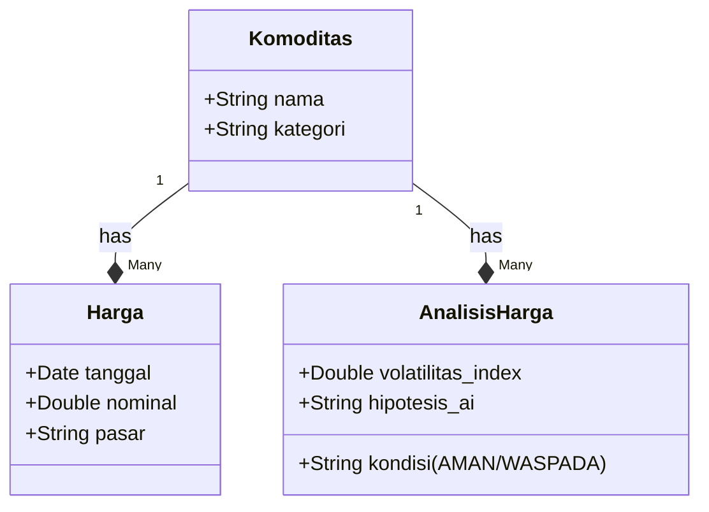

# 🦅 Harga (TPID Intelligence Core)

[](https://laravel.com)
[](https://www.php.net)
[](LICENSE)

**Harga** adalah sistem *backend* cerdas yang dirancang khusus untuk **Tim Pengendali Inflasi Daerah (TPID)**. Sistem ini berfungsi sebagai "otak" yang mengumpulkan data harga pangan dari berbagai sumber, menganalisis volatilitas pasar, dan menghasilkan wawasan strategis berbasis AI untuk mendukung pengambilan kebijakan.

> 🚀 **ATM Ready (Amati, Tiru, Modifikasi)**: Project ini dibangun dengan filosofi *open-collaboration*, memungkinkan setiap Kabupaten/Kota di Indonesia untuk menduplikasi dan menyesuaikan sistem ini dengan kondisi daerah masing-masing dalam hitungan menit.

---

## ✨ Fitur Unggulan

### 1. 🔌 Multi-Source Data Ingestion
Tidak perlu input manual yang melelahkan. Sistem ini secara otomatis menarik data dari:
- **SP2KP Kemendag** (Sistem Pemantauan Pasar Kebutuhan Pokok).
- **Google Sheets** (Untuk data lokal/manual yang fleksibel).
- **Sinkronisasi Hibrida**: Gabungkan kedua sumber data untuk akurasi maksimal.

### 2. 🧠 Context-Aware AI Analysis
Bukan sekadar grafik naik-turun. Modul `TpidReportService` kami menggunakan algoritma statistik canggih yang diperkaya dengan konteks eksternal:
- **Analisis Volatilitas**: Mendeteksi anomali harga menggunakan *Coefficient of Variation* (CV) dan ambang batas dinamis.
- **Integrasi Cuaca**: Mengorelasikan kenaikan harga dengan data curah hujan historis (metode *Visual Crossing*).
- **HET Monitoring**: Peringatan otomatis jika harga melampaui Harga Eceran Tertinggi (HET) pemerintah.
- **LLM Prompt Generation**: Menghasilkan *draft* laporan naratif siap pakai untuk rapat pimpinan daerah.

### 3. 🛡️ Enterprise-Grade Architecture
Dibangun di atas fondasi Laravel 11 yang kokoh:
- **API First**: Siap diintegrasikan dengan Frontend (React/Vue/Flutter) atau dashboard BI apapun.
- **Scalable Database**: Desain skema relasional yang efisien untuk menampung jutaan baris data *time-series*.
- **Retrospective Memory**: Menyimpan hasil analisis masa lalu untuk mengevaluasi akurasi prediksi AI seiring waktu.

---

## 🚀 Memulai (Quick Start)

Ingin menerapkan sistem ini di daerah Anda? Ikuti 4 langkah mudah ini:

1.  **Clone Repository**
    ```bash
    git clone https://github.com/username/harga.git
    cd harga
    ```
2.  **Setup Environment**
    Ikuti panduan lengkap di dokumen instalasi kami untuk mengatur database dan API Key.
    👉 **[BACA: PANDUAN INSTALASI LENGKAP](./SETUP_GUIDE.md)**

3.  **Konfigurasi Wilayah (ATM)**
    Sesuaikan `TPID_REGION_NAME` dan `SP2KP_PASAR_ID` di file `.env` Anda.

4.  **Jalankan Server**
    ```bash
    php artisan serve
    ```

---

## 🏗️ Arsitektur & Model Data

Sistem ini berpusat pada tiga entitas utama yang saling berinteraksi:



### 🔁 Alur Kerja Data (Data Flow)

1.  **Ingest**: `Scheduler` menarik data mentah dari SP2KP/Sheet -> Masuk ke tabel `hargas`.
2.  **Process**: User me-request analisis -> `TpidReportService` menghitung statistik 90 hari, mengecek cuaca, dan membandingkan HET.
3.  **Insight**: Sistem menyimpan *snapshot* analisis ke `analisis_harga` dan mengembalikan narasi strategis via API.

---

## 🗃️ Contoh Data (Data Sampler)

Berikut adalah gambaran nyata data yang dikelola sistem:

**1. Master Komoditas**
```json
{ "id": 1, "nama": "Beras Premium", "kategori": "POKOK" }
```

**2. Time-Series Harga**
```json
{ "tanggal": "2025-09-17", "harga": 14500, "pasar": "Pasar Sebukit Rama" }
```

**3. Output Analisis AI**
```json
{
    "status": "WASPADA",
    "observasi": "Harga naik 15% di atas HET akibat gangguan pasokan...",
    "rekomendasi": "Lakukan Operasi Pasar di titik distribusi utama."
}
```

---

## 🤝 Berkontribusi

Kami sangat terbuka dengan kontribusi dari pengembang di seluruh Indonesia!
Silakan buat *Pull Request* untuk fitur baru, perbaikan bug, atau penambahan adaptor data sumber baru.

## 📄 Lisensi

Aplikasi ini bersifat *Open Source* di bawah lisensi **[MIT License](https://opensource.org/licenses/MIT)**.
Bebas digunakan, dimodifikasi, dan didistribusikan untuk kepentingan Pemda maupun publik.
